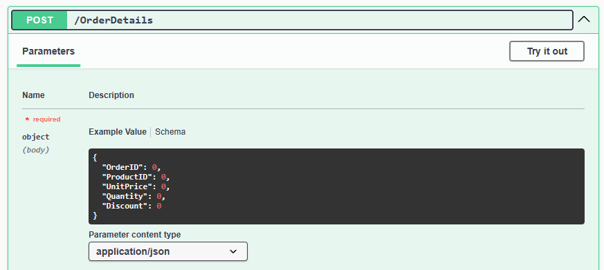

# OINO TS
 OINO Is Not an ORM but it's trying to solve a similar problem for API development. Instead of mirroring your DB schema in code that needs manual updates, OINO will get the data schema from DBMS using SQL in real time. Every time your app starts, it has an updated data model which allows you to automatically (de)serialize SQL results to JSON/CSV and back. OINO works on the level below routing where you pass the method, URL ID, body and request parameters to the API-object. OINO will parse and validate the data against the data model and generate proper SQL for your DB. Because OINO knows how data is serialized (e.g. JSON), what column it belongs to (e.g. floating point number) and what the target database is, it knows how to parse, format and escape the value as valid SQL.
 
 ```
 const result:OINOApiResult = await api_orderdetails.doRequest("GET", id, body, params)
 return new Response(result.modelset.writeString(OINOContentType.json))
 ```
 

 # GETTING STARTED
 
 ### Setup
 Install the `@oino-ts/core` npm package and necessary database packages and import them in your code.
 ```
 bun install @oino-ts/core
 bun install @oino-ts/bunsqlite
 ```
 
 ```
 import { OINODb, OINOApi, OINOFactory } from "@oino-ts/core";
 import { OINODbBunSqlite } from "@oino-ts/bunsqlite"
 ```
 
 ### Register database and logger
 Register your database implementation and logger (see [`OINOConsoleLog`](https://pragmatta.github.io/oino-ts/classes/core_src.OINOConsoleLog.html) how to implement your own)

 ```
 OINOLog.setLogger(new OINOConsoleLog())
 OINOFactory.registerDb("OINODbBunSqlite", OINODbBunSqlite)
 ```

 ### Create a database
 Creating a database connection [`OINODb`](https://pragmatta.github.io/oino-ts/classes/core_src_OINODb.OINODb.html) is done by passing [`OINODbParams`](https://pragmatta.github.io/oino-ts/types/core_src.OINODbParams.html) to the factory method. For [`OINODbBunSqlite`](https://pragmatta.github.io/oino-ts/classes/bunsqlite_OINODbBunSqlite.OINODbBunSqlite.html) that means a file url for the database file, for others network host, port, credentials etc.
 ```
 const db:OINODb = await OINOFactory.createDb( { type: "OINODbBunSqlite", url: "file://../localDb/northwind.sqlite" } )
 ```

 ### Create an API
 From a database you can create an [`OINOApi`](https://pragmatta.github.io/oino-ts/classes/core_src_OINOApi.OINOApi.html) by passing [`OINOApiParams`](https://pragmatta.github.io/oino-ts/types/core_src.OINOApiParams.html) with table name and preferences to the factory method.
 ```
 const api_employees:OINOApi = await OINOFactory.createApi(db, { tableName: "Employees", excludeFields:["BirthDate"] })
 ```

 ### Pass HTTP requests to API
 When you receive a HTTP request, just pass the method, URL ID, body and params to the correct API, which will parse and validate input and return results.

 ```
 const result:OINOApiResult = await api_orderdetails.doRequest("GET", id, body, params)
 ```

 ### Write results back to HTTP Response
 The results for a GET request will contain [`OINOModelSet`](https://pragmatta.github.io/oino-ts/classes/core_src_OINOModelSet.OINOModelSet.html) data that can be written out as JSON or CSV as needed. For other requests result is just success or error with messages.
 ```
 return new Response(result.modelset.writeString(OINOContentType.json))
 ```
 
 
 # FEATURES
 
 ## RESTfull
 OINO maps HTTP methods GET/POST/PUT/DELETE to SQL operations SELECT/INSERT/UPDATE/DELETE. The GET/POST requests can be made without URL ID to get all rows or insert new ones and others target a single row using URL ID. 
 
 ### HTTP GET
 ```
 Request and response:
 > curl.exe -X GET http://localhost:3001/orderdetails/11077:77
 [
   {"_OINOID_":"11077:77","OrderID":11077,"ProductID":77,"UnitPrice":13,"Quantity":2,"Discount":0}
 ]

 SQL:
 SELECT "OrderID","ProductID","UnitPrice","Quantity","Discount" FROM [OrderDetails] WHERE ("OrderID"=11077 AND "ProductID"=77);
 ```

 ### HTTP POST 
 ```
 Request and response:
 > curl.exe -X POST http://localhost:3001/orderdetails -H "Content-Type: application/json" --data '[{\"OrderID\":11077,\"ProductID\":99,\"UnitPrice\":19,\"Quantity\":1,\"Discount\":0}]'
 {"success":true,"statusCode":200,"statusMessage":"OK","messages":[]}

 SQL:
 INSERT INTO [OrderDetails] ("OrderID","ProductID","UnitPrice","Quantity","Discount") VALUES (11077,99,19,1,0);
 ```

 ### HTTP PUT
 ```
 Request and response:
 > curl.exe -X PUT http://localhost:3001/orderdetails/11077:99 -H "Content-Type: application/json" --data '[{\"UnitPrice\":20}]'
 {"success":true,"statusCode":200,"statusMessage":"OK","messages":[]}

 SQL:
 UPDATE [OrderDetails] SET "UnitPrice"=20 WHERE ("OrderID"=11077 AND "ProductID"=99);
 ```
 
 ### HTTP DELETE
 ```
 Request and response:
 > curl.exe -X DELETE http://localhost:3001/orderdetails/11077:99
 {"success":true,"statusCode":200,"statusMessage":"OK","messages":[]}

 SQL:
 DELETE FROM [OrderDetails] WHERE ("OrderID"=11077 AND "ProductID"=99);
 ```
  
 ## JSON/CSV Serialization
 OINO handles serialization of data to JSON and back based on the data model. It knows what columns exist, what is their data type and how to convert each to JSON/CSV and back. This allows also partial data to be sent, i.e. you can send only columns that are updated or even send extra columns and have them ignored.

 In addition to that OINO extends the JSON/CSV datamodel by supporting blob columns through BASE64 encoding and normalization of datetime columns to ISO 8601 format (you can also treat them as strings and handle proper formatting).

 ## Database Abstraction
 OINO functions as a database abstraction, providing a consistent interface for working with different databases. It abstracts out different conventions in connecting, making queries and formatting data.

 Currently supported databases:
 - Bun Sqlite through Bun native implementation
 - Postgresql through [pg](https://www.npmjs.com/package/pg)-package
 - Mariadb / Mysql-support through [mariadb](https://www.npmjs.com/package/mariadb)-package

 ## Complex Keys
 To support tables with multipart primary keys OINO generates a composite key `_OINOID_` that is included in the result and can be used as the REST ID. For example in the example above table `OrderDetails` has two primary keys `OrderID` and `ProductID` making the `_OINOID_` of form `11077:99`. 

 ## Power Of SQL
 Since OINO controls the SQL, WHERE-conditions can be defined through [`OINOFilter`](https://pragmatta.github.io/oino-ts/classes/core_src_OINOFilter.OINOFilter.html) that are passed as HTTP request parameters. No more API development where you make unique API endpoints for each filter that fetch all data with original API and filter in backend code. Every API can be filtered when and as needed without unnessecary data tranfer and utilizing SQL indexing when available.

 ## Swagger Support
 Swagger is great as long as the definitions are updated and with OINO you can automatically get a Swagger definition including a data model schema.
 ```
 if (url.pathname == "/swagger.json") {
    return new Response(JSON.stringify(OINOSwagger.getApiDefinition(api_array)))
 }
 ```
 

 ## Node support
 OINO is developped Typescript first but compiles to standard CommonJS and the NPM packages should work on either ESM / CommonJS. Checkout sample apps `readmeApp` (ESM) and `nodeApp` (CommonJS).


 # STATUS
 OINO is currently a hobby project which should and should considered in alpha status. That also means compatibility breaking changes can be made without prior notice when architectual issues are discovered.

 ## Beta
 For a beta status following milestones are planned:

 ### Realistic app
 There needs to be a realistic app built on top of OINO to get a better grasp of the edge cases.

 ### Security review
 Handling of SQL-injection attacks needs a thorough review, what are the relevant attack vectors are for OINO and what protections are still needed.
 
 ## Roadmap
 Things that need to happen in some order before beta-status are at least following:
 
 ### Support for views
 Simple cases of views would work already in some databases but edge cases might get complicated. For example 
 - How to handle a view which does not have a complete private key?
 - What edge cases exist in updating views?

 ### Batch updates
 Supporting batch updates similar to batch inserts is slightly bending the RESTfull principles but would still be a useful optional feature.

 ### Aggregation, ordering and limits
 Similar to filtering, aggregation, ordering and limits can be implemented as HTTP request parameters telling what column is aggregated or used for ordering or how many results to return.

 ### Streaming
 One core idea is to be efficient in not making unnecessary copies of the data and minimizing garbage collection debt. This can be taken further by implementing streaming, allowing large dataset to be written to HTTP response as SQL result rows are received.

 ### HTMX utils
 OINO is well suited to be used as almost complete backend for HTMX and this can be further helped with efficient utilities to map [`OINOModelSet`](https://pragmatta.github.io/oino-ts/classes/core_src_OINOModelSet.OINOModelSet.html) to HTMX template.
 
 ### SQL generation callbacks
 It would be useful to allow developer to validate / override SQL generation to cover cases OINO does not support or even workaround issues.

 ### Transactions
 Even though the basic case for OINO is executing SQL operations on individual rows, having an option to use SQL transactions could make sense at least for batch operations.


 # HELP
 
 ## Bug reports
 Fixing bugs is a priority and getting good quality bug reports helps. It's recommended to use the sample Northwind database included with project to replicate issues or make an SQL script export of the relevant table.
  
 ## Feedback
 Understanding and prioritizing the use cases for OINO is also important and feedback about how you'd use OINO is interesting. Feel free to raise issues and feature requests in Github, but understand that short term most of the effort goes towards reaching the beta stage.

 ## Typescript / Javascript architecture
 Typescript building with different targets and module-systemts and a ton of configuration is a complex domain and something I have little experience un so help in fixing problems and how thing ought to be done is appreciated.
 
 # LINKS
 - [Github repository](https://github.com/pragmatta/oino-ts)
 - [NPM repository](https://www.npmjs.com/org/oino-ts) 

 
 # ACKNOWLEDGEMENTS
 
 ## Libraries
 OINO uses the following open source libraries and npm packages and I would like to thank everyone for their contributions:
 - Postgresql support by [node-postgres package](https://www.npmjs.com/package/pg)
 - Mariadb / Mysql-support by [mariadb package](https://www.npmjs.com/package/mariadb)

 ## Bun
 OINO has been developed using the Bun runtime, not because of the speed improvements but for the first class Typescript support and integrated developper experience. Kudos on the bun team for making Typescript work more exiting again.
 
 ## SQL Scripts
 The SQL scripts for creating the sample Northwind database are based on [Google Code archive](https://code.google.com/archive/p/northwindextended/downloads) and have been further customized to ensure they would have identical data (in the scope of the automated testing).

