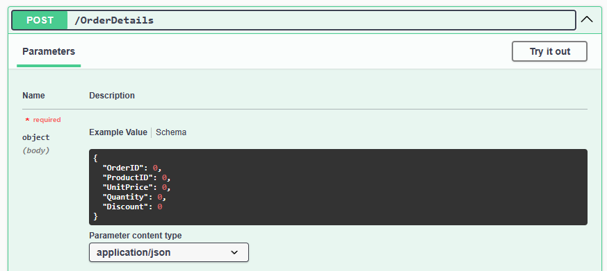

# OINO TS
OINO Is Not an ORM but it's trying to solve a similar problem for API development. Instead of mirroring your DB schema in code that needs manual updates, OINO will get the data schema from DBMS using SQL in real time. Every time your app starts, it has an updated data model which enables automatic (de)serialize SQL results to JSON/CSV and back. OINO works on the level below routing where you pass the method, URL ID, body and request parameters to the API-object. OINO will parse and validate the data against the data model and generate proper SQL for your DB. Because OINO knows how data is serialized (e.g. JSON), what column it belongs to (e.g. floating point number) and what the target database is, it knows how to parse, format and escape the value as valid SQL.

```
const result:OINOApiResult = await api_orderdetails.doRequest("GET", id, body, params)
return new Response(result.modelset.writeString(OINOContentType.json))
```


# GETTING STARTED

## Create Datasources

### Create an SQL DB

First install the `@oino-ts/db` npm package and necessary database packages and import them in your code.
```
bun install @oino-ts/db
bun install @oino-ts/db-bunsqlite
```

```
import { OINODb, OINODbFactory } from "@oino-ts/db";
import { OINOApi } from "@oino-ts/db";
import { OINODbBunSqlite } from "@oino-ts/db-bunsqlite"
```

Next register your database implementation and logger (see [`OINOConsoleLog`](https://pragmatta.github.io/oino-ts/classes/common_src.OINOConsoleLog.html) how to implement your own)

```
OINOLog.setLogger(new OINOConsoleLog())
OINODbFactory.registerDb("OINODbBunSqlite", OINODbBunSqlite)
```

Finally creating a database connection [`OINODb`](https://pragmatta.github.io/oino-ts/classes/db_src.OINODb.html) is done by passing [`OINODbParams`](https://pragmatta.github.io/oino-ts/types/db_src.OINODbParams.html) to the factory method. For [`OINODbBunSqlite`](https://pragmatta.github.io/oino-ts/classes/db_bunsqlite_src.OINODbBunSqlite.html) that means a file url for the database file, for others network host, port, credentials etc.
```
const db:OINODb = await OINODbFactory.createDb( { type: "OINODbBunSqlite", url: "file://../localDb/northwind.sqlite" } )
```

### Create NoSQL datasources
Creating NoSQL datasources works similarly by importing the [`OINONoSql`](https://pragmatta.github.io/oino-ts/modules/nosql_src.html) package and either the [`OINONoSqlAws`](https://pragmatta.github.io/oino-ts/modules/nosql-aws_src.html) or [`OINONoSqlAzure`](https://pragmatta.github.io/oino-ts/modules/nosql-azure_src.html), registering the implementation with the factory
```
OINONoSqlFactory.registerNoSql("OINONoSqlAzureTable", OINONoSqlAzureTable)
const nosql_azure_params = { type: "OINONoSqlAzureTable", table: "NorthwindOrders", credentials: { connectionStr: process.env.OINOCLOUD_TEST_BLOB_AZURE_CONSTR } }
const nosql_azure = await OINONoSqlFactory.createNoSql(nosql_azure_params)
```

NOTE! Format of the credentials varies by platform and might require extra authorization.

### Create Blob datasources
Creating Blob datasources works similarly by importing the [`OINOBlob`](https://pragmatta.github.io/oino-ts/classes/blob_src.OINOBlob.html) package and either the [`OINOBlobAws`](https://pragmatta.github.io/oino-ts/modules/blob-aws_src.html) or [`OINOBlobAzure`](https://pragmatta.github.io/oino-ts/modules/blob-azure_src.html), registering the implementation with the factory
```
OINOBlobFactory.registerBlob("OINOBlobAzureTable", OINOBlobAzureTable)
const Blob_azure_params = { type: "OINOBlobAzureTable", table: "NorthwindOrders", credentials: { connectionStr: process.env.OINOCLOUD_TEST_BLOB_AZURE_CONSTR } }
const Blob_azure = await OINOBlobFactory.createBlob(nosql_azure_params)
```

NOTE! Format of the credentials varies by platform and might require extra authorization.

## Create an API
From a datasource you can create an [`OINOApi`](https://pragmatta.github.io/oino-ts/classes/db_src.OINODbApi.html) by passing [`OINOApiParams`](https://pragmatta.github.io/oino-ts/types/db_src.OINODbApiParams.html) with table name and preferences to the factory method.
```
const api_employees:OINOApi = await OINOFactory.createApi(db, { tableName: "Employees", excludeFields:["BirthDate"] })
```

## Pass HTTP requests to API
When you receive a HTTP request, just pass the method, URL ID, body and params to the correct API, which will parse and validate input and return results.

```
const result:OINOApiResult = await api_orderdetails.doRequest("GET", id, body, params)
```

## Write results back to HTTP Response
The results for a GET request will contain [`OINOModelSet`](https://pragmatta.github.io/oino-ts/classes/common_src.OINOModelSet.html) data that can be written out as JSON or CSV as needed. For other requests result is just success or error with messages.
```
return new Response(result.data.writeString(OINOContentType.json))
```


# MAIN FEATURES

## RESTfull
OINO maps HTTP methods GET/POST/PUT/DELETE to SQL operations SELECT/INSERT/UPDATE/DELETE. The GET/POST requests can be made without URL ID to get all rows or insert new ones and others target a single row using URL ID. 

For example HTTP POST 
```
Request and response:
> curl.exe -X POST http://localhost:3001/orderdetails -H "Content-Type: application/json" --data '[{\"OrderID\":11077,\"ProductID\":99,\"UnitPrice\":19,\"Quantity\":1,\"Discount\":0}]'
{"success":true,"statusCode":200,"statusMessage":"OK","messages":[]}

SQL:
INSERT INTO [OrderDetails] ("OrderID","ProductID","UnitPrice","Quantity","Discount") VALUES (11077,99,19,1,0);
```


## Universal Serialization
OINO handles serialization of data to JSON/CSV/etc. and back based on the data model. It knows what columns exist, what is their data type and how to convert each to JSON/CSV and back. This allows also partial data to be sent, i.e. you can send only columns that need updating or even send extra columns and have them ignored.

- Files can be sent to BLOB fields using BASE64 or MIME multipart encoding. Also supports standard HTML form file submission to blob fields and returning them data url images.
- Datetimes are (optionally) normalized to ISO 8601 format.
- Extended JSON-encoding
  - Unquoted literal `undefined` can be used to represent non-existent values (leaving property out works too but preserving structure might be easier e.g. when translating data).
- CSV
  - Comma-separated, doublequotes.
  - Unquoted literal `null` represents null values.
  - Unquoted empty string represents undefined values.
- Form data
  - Multipart-mixed and binary files not supported.
  - Non-existent value line (i.e. nothing after the empty line) treated as a null value.
- Url-encoded
  - No null values, missing properties treated as undefined.
  - Multiple lines could be used to post multiple rows.


## Datasource Abstraction
OINO functions as a datasource abstraction for SQL, NoSQL and Blob storages, providing a consistent interface for working with different datasources. It abstracts out different conventions in connecting, making queries and formatting data.

Currently supported datasources:
- SQL
  - Bun Sqlite through Bun native implementation
  - Postgresql through [pg](https://www.npmjs.com/package/pg)-package
  - Mariadb / Mysql-support through [mariadb](https://www.npmjs.com/package/mariadb)-package
  - Sql Server through [mssql](https://www.npmjs.com/package/mssql)-package
- NoSQL
  - AWS DynamoDb through [@aws-sdk/client-dynamodb](https://www.npmjs.com/package/@aws-sdk/client-dynamodb)-package
  - Azure Tables through [@azure/data-tables](https://www.npmjs.com/package/@azure/data-tables)-package
- Blob
  - AWS S3 through [@aws-sdk/client-s3](https://www.npmjs.com/package/@aws-sdk/client-s3)-package
  - Azure Blobs through [@azure/storage-blob](https://www.npmjs.com/package/@azure/storage-blob)-package

## Composite Keys
To support tables with multipart primary keys OINO generates a composite key `_OINOID_` that is included in the result and can be used as the REST ID. For example in the example above table `OrderDetails` has two primary keys `OrderID` and `ProductID` making the `_OINOID_` of form `11077:99`. 

## Power Of SQL
Since OINO is just generating SQL, WHERE-conditions can be defined with [`OINOQueryFilter`](https://pragmatta.github.io/oino-ts/classes/common_src.OINOQueryFilter.html), order with [`OINOQueryOrder`](https://pragmatta.github.io/oino-ts/classes/common_src.OINOQueryOrder.html), limits/paging with [`OINOQueryLimit`](https://pragmatta.github.io/oino-ts/classes/common_src.OINOQueryLimit.html) and aggregation with [`OINOQueryAggregate`](https://pragmatta.github.io/oino-ts/classes/common_src.OINOQueryAggregate.html) that are passed as HTTP request parameters. No more API development where you make unique API endpoints for each filter that fetch all data with original API and filter in backend code. Every API can be filtered when and as needed without unnessecary data tranfer and utilizing SQL indexing when available.

Most of the filtering also works with NoSQL and Blob datasources but might less performant depending if the service supports it or if we result in software filtering the results.

## Swagger Support
Swagger is great as long as the definitions are updated and with OINO you can automatically get a Swagger definition including a data model schema.
```
if (url.pathname == "/swagger.json") {
  return new Response(JSON.stringify(OINOSwagger.getApiDefinition(api_array)))
}
```


## Node support
OINO is developped Typescript first but compiles to standard CommonJS and the NPM packages should work on either ESM / CommonJS. Checkout sample apps `readmeApp` (ESM) and `nodeApp` (CommonJS).

## HTMX support
OINO is [htmx.org](https://htmx.org)-friendly, allowing easy translation of [`OINODataRow`](https://pragmatta.github.io/oino-ts/types/db_src.OINODataRow.html) to HTML output using templates (cf. the [htmx sample app](https://github.com/pragmatta/oino-ts/tree/main/samples/htmxApp)).

## Hashids
Autoinc numeric id's are very pragmatic and fit well with OINO (e.g. using a form without primary key fields to insert new rows with database assigned ids). However it's not always sensible to share information about the sequence. Hashids solve this by masking the original values by encrypting the ids using AES-128 and some randomness. Length of the hashid can be chosen from 12-32 characters where longer ids provide more security. However this should not be considereded a cryptographic solution for keeping ids secret but rather making it infeasible to iterate all ids.

### Batch updates
Batch updates slight bend the RESTfull principles but there are separate `doBatchUpdate` endpoints (e.g. [OINODbApi.dobatchupdate](https://pragmatta.github.io/oino-ts/classes/db_src.OINODbApi.html#dobatchupdate)).

## Schema Management
OINO has endpoints for reading, creating and deleting table and column schemas.


# STATUS
OINO v1.1 is the first release considered production status. Architecture has now survived introduction NoSQL and Blov datasources and we feel comfortable saying it's stable now. Also we have been using it in [oino.cloud](https://oino.cloud) for a while without issues.

## Roadmap
Major features that are considered in future releases

### Views
It would be interesting to combine multiple datasources as OINO-views like multiple NoSQL-tables.

### Streaming
One core idea is to be efficient in not making unnecessary copies of the data and minimizing garbage collection debt. This can be taken further by implementing streaming, allowing large dataset to be written to HTTP response as SQL result rows are received.

### SQL generation callbacks
It would be useful to allow developer to validate / override SQL generation to cover cases OINO does not support or even workaround issues.


# HELP

## Bug reports
Fixing bugs is a priority and getting good quality bug reports helps. It's recommended to use the sample Northwind database included with project to replicate issues or make an SQL script export of the relevant table.

## Feedback
Understanding and prioritizing the use cases for OINO is also important and feedback about how you'd use OINO is interesting. Feel free to raise issues and feature requests in Github, but understand that short term most of the effort goes towards reaching the beta stage.


# LINKS
- [Github repository](https://github.com/pragmatta/oino-ts)
- [NPM repository](https://www.npmjs.com/org/oino-ts) 


# ACKNOWLEDGEMENTS

## Libraries
OINO uses the following open source libraries and npm packages and I would like to thank everyone for their contributions:
- Postgresql [node-postgres package](https://github.com/brianc/node-postgres)
- Mariadb / Mysql [mariadb package](https://github.com/mariadb-corporation/mariadb-connector-nodejs)
- Sql Server [mssql package](https://github.com/tediousjs/node-mssql)
- Custom base encoding [base-x package](https://github.com/cryptocoinjs/base-x)
- AWS JS SDK [aws-sdk](https://github.com/aws/aws-sdk-js-v3)
- Azure JS SDK [azure](https://github.com/Azure/azure-sdk-for-js)

## Bun
OINO has been developed using the Bun runtime, not because of the speed improvements but for the first class Typescript support and integrated developper experience. Kudos on the bun team for making Typescript work more exiting again.

## SQL Scripts
The SQL scripts for creating the sample Northwind database are based on [Google Code archive](https://code.google.com/archive/p/northwindextended/downloads) and have been further customized to ensure they would have identical data (in the scope of the automated testing).
